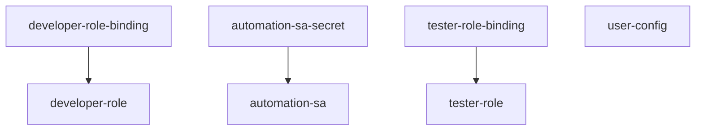

Sure! Here's a Mermaid diagram showing the dependencies for your Kubernetes setup:

This diagram illustrates the relationships between the various components in your Kubernetes setup. If you need further customization or additional details, feel free to let me know!